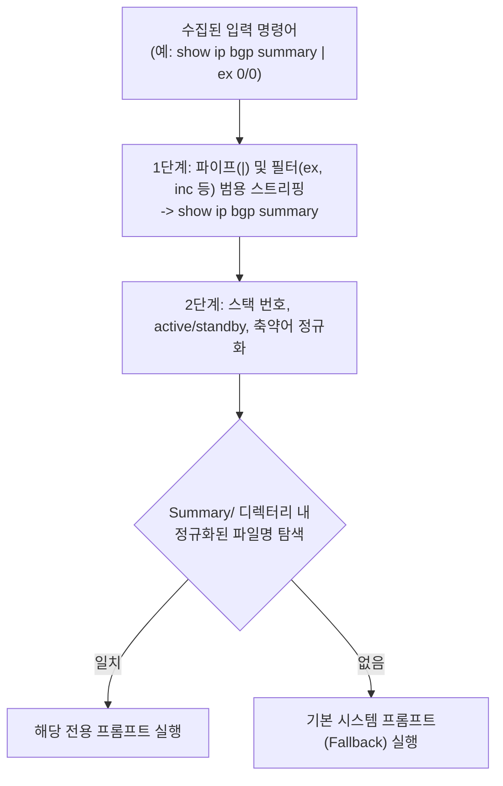

# GSS 신규 프롬프트 생성 표준 가이드라인 (PROMPT_GUIDE)

본 문서는 `01_GSS_LogCompare` 프로젝트에서 신규 네트워크 장비 점검 명령어의 AI 분석 프롬프트를 추가하거나 관리할 때 준수해야 하는 표준 가이드라인입니다.

현재 시스템은 수집된 다양한 형태의 로그 텍스트에서 **핵심 의도(Intent)**를 식별하여 최적의 AI 분석 지침을 매핑하는 구조(`PromptManager.cs`)로 동작합니다. 따라서 아래 표준 규칙을 준수하여 프롬프트를 생성해야 완벽하게 자동 매핑됩니다.

---

## 1. 파일 명명 규칙 (Naming Convention)

### ✅ 원칙 1: 오직 "기본 명령어(Base Command)"만 사용 (옵션/필터 전면 배제)
장비 수집 스크립트나 엔지니어가 터미널 스크롤 제어를 위해 붙인 파이프(`|`), 필터(`exclude`, `include`, `begin`, `section`), 윈도우 치환 문자(`_`)는 **파일명에 절대 포함하지 않는다.**
* **권장 (Good)**: `show ip route.txt`, `show ip bgp summary.txt`, `show processes cpu sorted.txt`
* **금지 (Bad)**: `show ip route _ include 10.txt`, `show ip bgp summary _ ex Idle.txt`, `show processes cpu sorted _ exclude 0.00.txt`

### ✅ 원칙 2: 동적 위치 번호(스택 번호, 슬롯, 파티션) 제거 (대표 템플릿 단일화)
스택 스위치 번호(`switch 1~8`), 플래시 파티션 번호(`flash1:`, `flash-1:`), 모듈/슬롯 번호 등 하드웨어 물리 위치 번호는 제거하고 **대표 파일 1개만** 생성한다.
* **권장 (Good)**: `show fwd-asic drops exceptions.txt`, `dir flash.txt`
* **금지 (Bad)**: `show fwd-asic drops exceptions switch 1.txt`, `dir flash1:.txt`

### ✅ 원칙 3: 축약어가 아닌 "표준 풀네임(Full Name)" 사용
CLI 콘솔에서는 `sh ip ro`, `sh run`, `sh int stat`처럼 축약하여 타이핑하더라도, 프롬프트 파일명은 항상 네트워크 표준 전체 단어로 명명한다. (시스템 내부의 정규화 엔진이 축약어를 풀네임으로 자동 매핑한다.)
* **권장 (Good)**: `show running-config.txt`, `show ip interface brief.txt`, `show interfaces transceiver detail.txt`
* **금지 (Bad)**: `sh run.txt`, `sh ip int br.txt`, `show inter tran de.txt`

### ✅ 원칙 4: 파일명 끝 공백 및 특수문자 금지
파일명 끝에 보이지 않는 공백(` .txt`)이 들어가면 윈도우 파일 시스템과 C# 간에 미인식 결함이 발생한다.
* 영문 소문자, 단일 띄어쓰기(스페이스), 숫자, 하이픈(`-`)만 사용할 것.

---

## 2. 저장 위치 규칙 (Directory Structure)

| 구분 | 저장 경로 | 설명 |
| :--- | :--- | :--- |
| **1차 로그 요약 (Stage 1)** | `.prompts/Summary/<기본명령어>.txt` | **[필수]** 새로 수집되는 모든 명령어에 대해 개별 분석 프롬프트 작성 |
| **2차 교차 정밀 진단 (Stage 2)** | `.prompts/Diagnosis/<기본명령어>.txt` | **[선택]** CPU, 인터페이스, 환경/전원 등 주요 장애 명령어에 한해 정밀 진단 지침 작성 (없을 경우 자동으로 `Diagnosis/default.txt`가 폴백 수행) |

---

## 3. 프롬프트 본문 표준 템플릿 (Content Template)

### 📌 1차 요약 프롬프트 (`Summary/*.txt`) 표준 구조
1차 요약 프롬프트는 AI가 장비 로그를 읽고 핵심 상태를 파악하여 Severity를 판정하고 DB에 저장하도록 유도하는 필수 4단계 단락을 준수해야 합니다.

```text
당신은 Cisco 스위치 [도메인/장애영역] 분석 전문가이다.
{deviceName} 설비의 '{command}' 로그를 정밀 분석하여 다음 정보를 요약하고 DB에 저장하라:

1. [핵심 점검 지표 1]:
   - 로그 텍스트에서 AI가 중점적으로 파악해야 할 항목 (예: 업/다운 상태, 점유율, 에러 카운트)
2. [잠재 장애 가능성 평가 2]:
   - 수치가 비정상일 때 발생할 수 있는 네트워크 영향 및 위험 징후 평가

[상태 심각도(Severity) 판정 기준]
- Normal: 권장 수치 이내이거나 에러 카운터가 0인 정상 상태.
- Warning: 경미한 패킷 드롭, 일시적 부하 상승, 부분 링크 불안정 감지 시.
- Critical: 링크 다운, 프로세스 정지, 임계치 초과 고부하 등 즉각적인 장애 위험 시.

분석 완료 후 반드시 'SaveDeviceSummary' 함수를 호출하여 요약 결과를 마크다운 형식으로 저장하라.
일반 텍스트 대화로 응답 종료 절대 금지.
```

### 📌 2차 교차 정밀 진단 프롬프트 (`Diagnosis/*.txt`) 표준 구조
1차 요약에서 Warning/Critical이 감지되었을 때 타 명령어 요약본을 교차 대조(Cross-Correlation)하기 위한 지침입니다.

```text
당신은 Cisco 스위치 [도메인/장애영역] 원인 규명 전문 AI 네트워크 진단 엔지니어이다.
[{deviceName}] 장비의 '{command}' 항목에서 이상 징후(심각도: {severity})가 감지되었다.

[1차 요약 분석 결과]
{summaryText}

[교차 정밀 진단 지침]
1. 'GetPeerCommandSummaries' 도구를 호출하여 동일 날짜({dateStr})의 타 명령어 요약본을 모두 조회하라.
2. 특히 다음 연관 항목들을 중점적으로 교차 대조하여 근본 원인을 규명하라:
   - `show logging`: 장애 발생 시점 전후의 시스템 에러 로그 대조
   - `[연관 명령어]`: 상호 연관 지표 대조
3. 분석 결과를 종합하여 'SaveDeviceDiagnosis' 도구로 저장하라:
   - [근본 원인 추론 (Root Cause)]
   - [타 명령어와의 상관관계]
   - [영향도 평가]
   - [긴급 권고 조치 사항 (Action Items)]
일반 대화로 응답 종료 절대 금지.
```

---

## 4. 지원되는 템플릿 예약어 (치환 변수)

프롬프트 실행 시 C# `PromptManager`가 런타임에 동적으로 치환하는 변수 목록입니다:

| 변수명 | 적용 범위 | 설명 |
| :--- | :--- | :--- |
| `{deviceName}` | 1차 / 2차 공통 | 수집 대상 네트워크 장비명 |
| `{command}` | 1차 / 2차 공통 | 장비에서 수집된 실제 명령어 원문 |
| `{dateStr}` | 2차 진단 전용 | 로그 수집 일자 (`YYYY-MM-DD`) |
| `{severity}` | 2차 진단 전용 | 1차 요약에서 판정된 심각도 (`Warning` 또는 `Critical`) |
| `{summaryText}` | 2차 진단 전용 | 1차 요약 분석 결과 본문 |

---

## 5. 정규화 매칭 흐름 (PromptManager 파이프라인)

명령어가 입력되었을 때 시스템이 프롬프트를 탐색하는 우선순위입니다:


