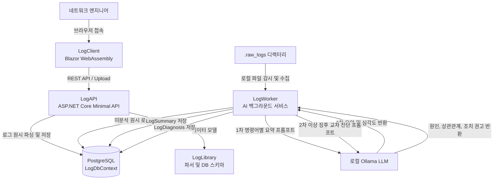

# LogCompare 요구사항 정의서

대용량 네트워크 장비 콘솔 로그를 파싱 및 구조화하여 저장하고, 시각적 변경점 비교 및 로컬 AI를 활용한 2단계 계층형 이상 징후 분석, 요약, 교차 정밀 진단을 제공하는 통합 로그 분석 플랫폼 LogCompare의 요구사항 명세서입니다.

---

## 1. 프로젝트 개요 및 목표

- **프로젝트명**: LogCompare
- **타깃 런타임**: .NET 10, Blazor WebAssembly, ASP.NET Core Minimal API
- **주요 목표**:
  1. 수천에서 수만 줄에 달하는 네트워크 장비 점검 로그의 자동 파싱 및 데이터베이스 구조화 적재.
  2. Blazor WebAssembly 기반 가상화 UI를 통한 대용량 텍스트의 지연 없는 조회 및 시각적 Diff 비교.
  3. 로컬 AI 모델 연동을 통해 사내 환경에서도 외부 유출 없이 2단계 계층형 로그 요약 및 위험 요소 심층 교차 진단 제공.

---

## 2. 시스템 아키텍처 및 모듈 구성

### 모듈별 역할
1. **`LogClient`**:
   - Blazor WebAssembly 기반 단일 페이지 애플리케이션입니다.
   - 대용량 로그 렌더링을 위한 가상 스크롤 컴포넌트를 지원합니다.
   - 인라인 및 좌우 나란히 비교 가능한 로그 변경점 Diff 뷰어를 제공합니다.
   - 에러, 경고 등 시스템 로그 심각도 레벨별 시각적 하이라이팅을 지원합니다.
   - 명령어별 1차 요약 및 심각도 배지 표시, 2차 심층 교차 진단 리포트 카드를 제공합니다.
   - 장비 로그 콘텍스트 기반 실시간 AI 대화형 질의응답을 제공합니다.
2. **`LogAPI`**:
   - ASP.NET Core Minimal API 기반 RESTful 백엔드 서비스입니다.
   - 다중 로그 파일 업로드 및 스트리밍 파싱 엔드포인트를 제공합니다.
   - 장비 목록, 날짜별 원시 로그, 1차 요약 및 2차 진단 데이터 조회 API를 제공합니다.
   - API 문서화 자동화를 지원합니다.
3. **`LogWorker`**:
   - Semantic Kernel 기반 백그라운드 분석 데몬입니다.
   - 로컬 디렉터리 파일 자동 감지 및 데이터베이스 적재를 수행합니다.
   - 미분석 원시 로그를 감지하여 1차 요약 및 2차 교차 진단 2단계 파이프라인을 자율 수행합니다.
4. **`LogLibrary`**:
   - 공통 데이터 모델 및 `LogDbContext`를 정의합니다.
   - 터미널 콘솔 로그 전용 파싱 엔진을 포함합니다.

---

## 3. 세부 기능 명세

### 3.1. 로그 수집 및 파싱 엔진
- **수집 경로 다변화**:
  - 웹 UI에서 다중 파일을 선택하여 API를 통해 전송하고 즉시 파싱합니다.
  - 백그라운드 워커가 로컬 디렉터리에 유입된 파일을 주기적으로 감지하여 일괄 적재합니다.
- **파일명 기반 메타데이터 정밀 추출**:
  - 파일명의 다중 구분자 패턴에서 확장자를 안전하게 분리하고 정규식을 적용하여 점검 일자를 정밀 추출합니다.
  - 파일명에서 날짜 추출 실패 시에만 현재 일자로 폴백 처리하여 과거 점검 이력 데이터가 오늘 날짜로 오염 적재되는 현상을 방지합니다.
- **원시 로그 파싱 및 분할**:
  - 장비 프롬프트 및 실행 명령어를 기준으로 블록을 분할합니다.
  - 시스템 로그 표준 헤더를 파싱하여 심각도 레벨을 분류합니다.
- **데이터베이스 적재 및 무결성 보장**:
  - 신규 장비 자동 등록 시 충돌 방지 로직을 적용하여 동시성 문제를 예방합니다.
  - 동일 장비 및 동일 시점의 중복 로그 업로드 시 사전 필터링을 통해 무결성을 보장합니다.

### 3.2. 대용량 뷰어, Diff 및 AI 분석 인터페이스
- **가상화 스크롤 렌더링**:
  - 수만 줄 이상의 텍스트 로그 렌더링 시 브라우저 과부하를 방지하기 위해 가상화 렌더링을 적용합니다.
- **시각적 Diff 비교**:
  - 동일 장비의 날짜별 점검 로그 선택 후 상호 변경점을 색상별로 시각화합니다.
- **로그 하이라이팅 및 필터**:
  - 에러, 경고, 포트 다운 등 주요 시스템 메시지를 강조 표시하고 레벨별로 필터링합니다.
- **AI 계층형 분석 표출 패널**:
  - 명령어별 1차 요약 결과와 함께 정상, 주의, 위험 3단계 상태 심각도 배지를 표시합니다.
  - 이상 징후 항목 선택 시 2차 정밀 교차 진단 결과 카드 및 인과관계 파악에 참고된 타 명령어 태그를 렌더링합니다.
- **대화형 AI 어시스턴트**:
  - 선택한 장비 및 시점의 로그 데이터를 기반으로 사용자 질의에 답변하는 실시간 대화 기능을 제공합니다.

### 3.3. 로컬 LLM 계층형 자동 요약 및 교차 진단 워커
- **데이터 기반 직접 분석 파이프라인**:
  - 장비 모델 식별 전처리 실패로 인한 분석 중단을 방지하기 위해 모델 의존성을 배제합니다.
  - 데이터베이스에 실제로 적재된 해당 장비의 최근 명령어 목록을 직접 추출하여 1차 요약 및 2차 교차 진단을 수행합니다.
- **2단계 계층형 분석 파이프라인**:
  - **1차 파이프라인 (명령어별 독립 요약)**:
    - 원시 로그를 명령어 단위로 분석하여 핵심 요약 및 심각도를 판정하여 저장합니다.
  - **2차 파이프라인 (도메인 지식 기반 교차 정밀 진단)**:
    - 해당 설비 및 대상 날짜의 모든 활성 명령어 1차 요약이 완료된 시점에 진입합니다.
    - 1차 분석 결과 중 이상 징후가 포착된 항목을 선별합니다.
    - 해당 설비의 타 명령어 1차 요약본 전체를 교차 대조하여 문제의 근본 원인, 명령어 간 상관관계, 영향도 평가, 현장 긴급 조치 권고안을 종합 진단하여 저장합니다.
- **프롬프트 단일화 및 계층형 정규화 매칭 엔진**:
  - **비종속적 의도 매핑 원칙**: 장비 출력의 가변 옵션에 얽매이지 않고 로그 본질의 핵심 분석 의도를 식별하여 프롬프트를 매핑합니다.
  - **순수 기본 명령어 단일화**: 스택 번호, 파티션, 파이프 필터링 옵션 등을 파일명에서 제거하고 순수 기본 명령어 대표 템플릿으로 단일화합니다.
  - **계층형 정규화 탐색 파이프라인**:
    1. 1순위: 입력된 명령어와 정확히 일치하는 전용 프롬프트 파일 탐색
    2. 2순위: 특수문자 치환 파일명 탐색
    3. 3순위: 파이프 스트리핑, 스택 번호 제거, 축약어 정규화를 거쳐 기본 대표 파일 자동 매핑
    4. 최종 폴백: 전용 프롬프트가 없을 경우 공통 시스템 프롬프트 또는 기본 프롬프트 자동 적용
  - **기술 지시체 표준화**: AI의 도구 호출 누락 및 사족 생성을 차단하기 위해 단호한 기술 지시체 규격을 준수합니다.
  - **신규 프롬프트 가이드라인 준수**: 향후 신규 명령어 추가 시 표준 가이드라인 규격을 준수합니다.
- **분석 주기 및 중복 방지**:
  - 미요약 로그 풀을 주기적으로 감지하여 일괄 분석을 수행합니다.
  - 요약 또는 진단 데이터가 이미 존재하는 건은 재분석을 수행하지 않고 안전하게 건너뜁니다.
  - 일시적 타임아웃 또는 데이터베이스 연결 오류 시 지연 후 자동 재시도 루프를 유지합니다.
- **대량 적재 시 메모리 관리**:
  - 대량 엔티티 처리 후 변경 추적기를 초기화하여 메모리 누수를 방지합니다.

### 3.4. 백엔드 RESTful API 엔드포인트 명세
- `POST /api/upload`: 다중 로그 파일 스트리밍 수집 및 원시 파싱 적재
- `GET /api/devices`: 등록된 장비 목록 및 메타데이터 조회
- `GET /api/devices/{deviceName}/dates`: 특정 장비의 로그 수집 일자 목록 조회
- `GET /api/rawlogs`: 장비명, 날짜, 명령어 조건에 따른 원본 로그 텍스트 조회
- `GET /api/summary`: 특정 장비 및 날짜의 1차 요약 목록 및 연관 진단 결과 조회
- `GET /api/diagnosis`: 특정 장비, 날짜, 명령어의 2차 정밀 교차 진단 결과 단독 조회
- `POST /api/chat`: 특정 장비 및 날짜 콘텍스트 기반 대화형 AI 질의응답

---

## 4. 데이터베이스 및 스키마 명세

- **DBMS**: PostgreSQL 15 이상

| 테이블명 | 역할 및 설명 | 주요 컬럼 |
| :--- | :--- | :--- |
| **`Devices`** | 네트워크 장비 마스터 | `Id`, `DeviceName`, `Description`, `StackCount`, `CreatedAt` |
| **`RawLogs`** | 파싱된 원시 로그 데이터 | `Id`, `DeviceName`, `Command`, `Content`, `Date`, `CreatedAt` |
| **`LogSummaries`** | 1차 명령어별 독립 요약 및 상태 심각도 | `Id`, `DeviceName`, `Date`, `Command`, `SummaryText`, `Severity`, `UpdatedAt` |
| **`LogDiagnoses`** | 2차 이상 징후 심층 교차 진단 결과 | `Id`, `LogSummaryId`, `DeviceName`, `Date`, `Command`, `ReferencedCommands`, `DiagnosisText`, `Severity`, `CreatedAt`, `UpdatedAt` |
| **`DeviceModels`** | 장비 모델 프리셋 마스터 (선택적 참조) | `ModelName` |
| **`DeviceToModelMappings`**| 설비별 모델 매핑 정보 (선택적 참조) | `DeviceName`, `ModelName`, `UpdatedAt` |
| **`ModelCommands`** | 관리자 정의 모델별 표준 점검 명령어 프리셋 (선택적 참조) | `ModelName`, `CommandText`, `IsEnabled` |

> [!NOTE]
> `DeviceModels`, `DeviceToModelMappings`, `ModelCommands` 테이블은 관리자 프리셋 및 참조용 메타데이터입니다. 실제 분석 파이프라인은 모델 매핑 실패로 인한 분석 중단을 방지하기 위해 `RawLogs`에 실제로 적재된 명령어를 직접 추출하여 자율적으로 계층형 분석을 수행합니다.

---

## 5. 비기능 요구사항 및 안전 가드

1. **대용량 메모리 보호**:
   - API에서 전체 로그 무제한 조회 엔드포인트 노출을 제한하고 페이징 조회를 적용합니다.
   - 워커 배치 처리 시 엔티티 변경 추적기를 초기화하여 메모리 누수를 방지합니다.
2. **폐쇄망 및 사내 독립성**:
   - AI 분석 시 외부 클라우드 API를 호출하지 않고 사내 로컬 LLM 인스턴스만을 사용합니다.
3. **컨테이너 호환성**:
   - 컨테이너 오케스트레이션을 통해 데이터베이스, 백엔드 API, 프론트엔드, AI 워커가 단일 명령어로 기동 가능하도록 구성합니다.
   - 리눅스 컨테이너 환경을 고려하여 운영체제 독립적인 네트워크 및 호스트 설정을 적용합니다.
