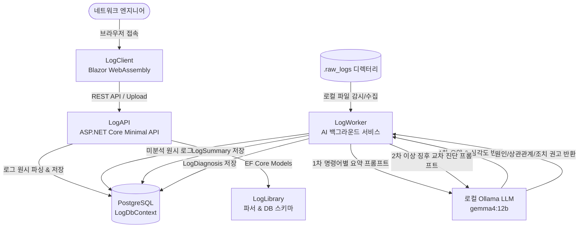

# LogCompare 요구사항 정의서 (PRD.md)

네트워크 장비(Cisco 등)의 대용량 터미널 콘솔 로그를 파싱 및 구조화하여 저장하고, 시각적 변경점 비교(Diff) 및 로컬 LLM(Ollama + Semantic Kernel)을 활용한 2단계 계층형 이상 징후 분석·요약·교차 정밀 진단을 제공하는 통합 로그 분석 플랫폼 `01_LogCompare`의 요구사항 명세서입니다.

---

## 1. 프로젝트 개요 및 목표 (Overview & Objectives)

- **프로젝트명**: `01_LogCompare`
- **타깃 런타임**: .NET 10 (C# 13+), Blazor WebAssembly, ASP.NET Core Minimal API
- **주요 목표**:
  1. 수천~수만 줄에 달하는 네트워크 장비 점검 로그(Show version, Show running-config 등)의 자동 파싱 및 DB 구조화 적재.
  2. Blazor WASM 기반 가상화 UI를 통한 대용량 텍스트의 렉(Freezing) 없는 조회 및 시각적 Diff 비교.
  3. 로컬 AI 모델(Ollama - `gemma4:12b` 등)을 연동하여 폐쇄망/사내 환경에서도 외부 유출 없이 2단계 계층형 로그 요약 및 위험 요소 심층 교차 진단 제공.

---

## 2. 시스템 아키텍처 및 모듈 구성 (Architecture)

### 모듈별 역할
1. **`LogClient` (Frontend)**:
   - Blazor WebAssembly 기반 SPA.
   - 대용량 로그 렌더링을 위한 `<Virtualize>` 가상 스크롤 지원.
   - `DiffPlex` 기반의 인라인/사이드바이사이드(Side-by-Side) 로그 변경점 비교.
   - Cisco Syslog 패턴(`%FACILITY-LEVEL-MNEMONIC`) 에러/경고 레벨별 시각적 하이라이팅.
   - **`LogSummaryPanel`**: 명령어별 1차 요약 및 심각도 배지(`Normal`, `Warning`, `Critical`) 동적 표출, 2차 심층 교차 진단 리포트 카드 및 참고 명령어 태그 표출.
   - **`AiChat`**: 장비 로그 기반 실시간 AI 대화형 질의응답.
2. **`LogAPI` (Backend)**:
   - ASP.NET Core Minimal API 기반 RESTful 백엔드.
   - 다중 로그 파일 업로드 및 스트리밍 파싱 엔드포인트 제공.
   - 장비 목록, 날짜별 원시 로그, 1차 요약 및 2차 진단 데이터 반환 API 제공.
   - Swagger / Scalar 기반 API 문서화 자동화.
3. **`LogWorker` (AI Worker)**:
   - Microsoft Semantic Kernel 기반 백그라운드 워커 데몬.
   - 로컬 디렉터리(`.raw_logs`) 파일 자동 감지 및 DB 적재(`ILogIngestionManager`).
   - 미분석 원시 로그를 감지하여 1차 요약(`LogSummary`) 및 2차 정밀 교차 진단(`LogDiagnosis`) 2단계 파이프라인 자율 수행.
4. **`LogLibrary` (Core Library)**:
   - EF Core 데이터 모델(`CiscoDevice`, `RawLog`, `LogSummary`, `LogDiagnosis` 등) 및 `LogDbContext`.
   - Cisco 콘솔 로그 전용 파싱 엔진(`StringParser`).

---

## 3. 세부 기능 명세 (Functional Requirements)

### 3.1. 로그 수집 및 파싱 엔진 (`StringParser` & `LogIngestionManager`)
- **수집 경로의 다변화**:
  - **웹 UI 업로드**: `LogClient`에서 다중 파일 선택 후 `LogAPI` (`/api/upload`)를 통해 전송 및 즉시 파싱.
  - **로컬 디렉터리 자동 수집**: `LogWorker`가 `.raw_logs` 폴더에 유입된 파일을 주기적으로 감지하여 일괄 DB 적재.
- **파일명 기반 메타데이터 안전 추출 (`TryParseFileName`)**:
  - 지원 파일명 규격: `{DeviceName}.{Date}.txt`, `{DeviceName}.{Date}.DeviceOutput.txt` 및 `.log` 확장자 지원.
  - 다중 도트(`.`) 및 특수 확장자 환경에서도 확장자(`.txt`, `.log`)를 사전에 안전 분리하고, 정규식 `(?:\.|^)(\d{8})(?:\.|$)` 패턴을 적용하여 과거 점검 일자(`yyyyMMdd`)를 정밀 추출.
  - 파일명에서 날짜 추출 실패 시에만 현재 일자(오늘)로 폴백 처리하여, 과거 점검 이력 데이터가 오늘 날짜로 잘못 오염 적재되는 현상을 원천 방어.
- **원시 로그 파싱 및 분할**:
  - 장비 프롬프트(`Router#`, `Switch#` 등) 및 실행 명령어(`show ...`)를 기준으로 블록 분할.
  - Cisco Syslog 표준 헤더 파싱 및 심각도 레벨(Emergency ~ Debugging) 분류.
- **DB 적재 및 중복 방지**:
  - 신규 장비 자동 등록 시 `ON CONFLICT ("DeviceName") DO NOTHING`을 적용하여 동시성 충돌 방지.
  - 동일 장비/동일 시점의 중복 로그 업로드 시 사전 필터링을 통해 무결성 보장.

### 3.2. 대용량 뷰어, Diff 및 AI 분석 인터페이스 (`LogClient`)
- **가상화 스크롤 렌더링**:
  - 수만 줄 이상의 텍스트 로그 렌더링 시 DOM 과부하를 막기 위해 Blazor `<Virtualize>` 컴포넌트 필수 적용.
- **로그 비교(Diff)**:
  - 동일 장비의 날짜별 점검 로그 선택 후 상호 변경점(추가/삭제/수정)을 색상별로 시각화.
- **로그 하이라이팅 & 필터**:
  - 에러(Error), 경고(Warning), 인터페이스 Down 등 중요 시스템 메시지 강조 표시 및 레벨 필터링.
- **AI 계층형 분석 표출 패널 (`LogSummaryPanel`)**:
  - 명령어별 1차 요약 결과와 함께 상태 심각도 배지(`Normal`: 초록, `Warning`: 주황, `Critical`: 빨강) 표시.
  - Warning/Critical 항목 선택 시 2차 정밀 교차 진단 결과 카드(`DiagnosisText`) 및 인과관계 파악에 참고된 타 명령어 태그(`ReferencedCommands`) 동시 렌더링.
- **대화형 AI 어시스턴트 (`AiChat`)**:
  - 선택한 장비 및 시점의 로그 데이터를 기반으로 사용자 질의에 답변하는 실시간 채팅 기능.

### 3.3. 로컬 LLM 계층형(2-Tier) 자동 요약 및 교차 진단 워커 (`LogWorker`)
- **데이터 기반 직접 분석 파이프라인 (Data-Driven)**:
  - 장비 모델명 식별(`SyncDeviceModels`) 전처리 루프의 실패로 인한 분석 중단(SPOF)을 원천 방지하기 위해 모델 식별 의존성을 제거.
  - DB의 `RawLogs`에 실제로 적재된 해당 장비의 최근 6개월 명령어 목록을 직접 추출하여 즉시 1차 요약 및 2차 교차 진단에 진입.
- **2단계 계층형 분석 파이프라인**:
  - **1차 파이프라인 (명령어별 독립 요약: `LogSummary`)**:
    - 원시 로그(`RawLogs`)를 명령어 단위로 분석하여 핵심 요약(`SummaryText`), 심각도(`Severity`: Normal/Warning/Critical)를 판정 후 `LogSummaries` 테이블에 저장.
  - **2차 파이프라인 (도메인 지식 기반 교차 정밀 진단: `LogDiagnosis`)**:
    - 해당 설비 및 대상 날짜의 모든 활성 명령어 1차 요약이 완료된 시점에 진입 (`hasPendingStage1` 검사를 통해 1차 미완료 시 2차 진단 안전 보류).
    - 1차 분석 결과 중 이상 징후(`Severity != 'Normal'`)가 포착되고 아직 2차 진단이 없는 항목을 선별.
    - 해당 설비의 타 명령어 1차 요약본 전체를 교차 대조하여 근본 원인(Root Cause), 타 명령어와의 상관관계, 영향도 평가, 현장 긴급 조치 권고안(Action Items)을 종합 진단한 뒤 `LogDiagnoses` 테이블에 저장(`DiagnosisText`, `ReferencedCommands`, `Severity`).
- **프롬프트 단일화 및 계층형 정규화 매칭 엔진 (`PromptManager`)**:
  - **비종속적 의도 매핑 원칙 (Decoupled Intent Mapping)**: 본 시스템은 장비에 CLI를 전송하는 에이전트가 아니므로, 장비 출력의 가변 옵션에 얽매이지 않고 로그 본질의 핵심 분석 의도(Intent)를 식별하여 프롬프트를 매핑함.
  - **순수 기본 명령어 단일화 (Pure Base Naming)**: 스택 번호(`switch 1~4`), 디스크 파티션(`flash1:`), CLI 파이프 필터링 옵션(`_ exclude ...`, `_ in Pool Total`) 등을 파일명에서 전면 제거하고 순수 기본 명령어(예: `show processes cpu sorted.txt`, `show interface status.txt`, `dir flash.txt`) 대표 템플릿으로 단일화.
  - **3단계 계층형 정규화 탐색 파이프라인 (`TryFindPrompt`)**:
    1. **1순위 (Exact Match)**: 입력된 명령어와 정확히 일치하는 전용 프롬프트 파일 탐색.
    2. **2순위 (Sanitized Match)**: 윈도우 파일 시스템 특수문자 치환 파일명 탐색.
    3. **3순위 (Normalized Base Fallback)**: 범용 파이프 스트리핑(`\s*(\||_)\s*(exclude|ex|include|inc|in|begin|section)\b.*$`), 스택 번호 제거, 디스크/축약어 정규화를 거쳐 기본 대표 파일 자동 매핑.
    4. **최종 폴백 (Default Fallback)**: 전용 프롬프트가 없을 경우 공통 시스템 프롬프트(1차) 또는 `default.txt`(2차) 자동 적용.
  - **기술 지시체(`~하라`, `~할 것`) 표준화**: AI의 도구 호출(`SaveDeviceSummary`, `SaveDeviceDiagnosis`) 누락 및 사족 생성을 차단하기 위해 단호한 기술 지시체 및 일반 대화 응답 절대 금지 제약 준수.
  - **신규 프롬프트 가이드라인 준수**: 향후 신규 명령어 추가 시 [`.prompts/PROMPT_GUIDE.md`](./.prompts/PROMPT_GUIDE.md) 표준 규격 준수.
- **분석 주기 및 재시도/중복 스킵 (Retry & Skip)**:
  - 미요약 로그 풀을 주기적으로 감지하여 일괄 분석 수행.
  - 1차 요약(`LogSummary`) 또는 2차 진단(`LogDiagnosis`) 데이터가 이미 존재하는 건은 LLM을 재호출하지 않고 안전하게 건너뜀(Skip, 멱등성 보장).
  - 일시적 LLM 타임아웃 또는 DB 연결 에러 시 지연 후 자동 재시도 루프 유지.
- **대량 적재 시 메모리 관리**:
  - 대량 엔티티 처리 후 `ChangeTracker.Clear()`를 호출하여 OOM(Out of Memory) 메모리 누수 방지.

### 3.4. 백엔드 RESTful API 엔드포인트 명세 (`LogAPI`)
- **`POST /api/upload`**: 다중 로그 파일 스트리밍 수집 및 원시 파싱/적재.
- **`GET /api/devices`**: 등록된 장비 목록 및 메타데이터 조회.
- **`GET /api/devices/{deviceName}/dates`**: 특정 장비의 로그 수집 일자 목록 조회.
- **`GET /api/rawlogs`**: 장비명, 날짜, 명령어 조건에 따른 원본 로그 텍스트 조회.
- **`GET /api/summary`**: 특정 장비 및 날짜의 1차 요약 목록 조회 (연관된 2차 진단 `Diagnosis` 객체 포함).
- **`GET /api/diagnosis`**: 특정 장비, 날짜, 명령어의 2차 정밀 교차 진단 결과 단독 조회.
- **`POST /api/chat`**: 특정 장비/날짜 콘텍스트 기반 대화형 AI 질의응답.

---

## 4. 데이터베이스 및 스키마 명세 (Database Schema)

- **DBMS**: PostgreSQL 15+ (EF Core Npgsql Provider)

| 테이블명 | 역할 및 설명 | 주요 컬럼 |
| :--- | :--- | :--- |
| **`Devices`** | 네트워크 장비 마스터 | `Id`, `DeviceName` (Unique), `Description`, `StackCount`, `CreatedAt` |
| **`RawLogs`** | 파싱된 원시 로그 데이터 (분석의 원천 소스) | `Id`, `DeviceName`, `Command`, `Content`, `Date`, `CreatedAt` |
| **`LogSummaries`** | 1차 명령어별 독립 요약 및 상태 심각도 | `Id`, `DeviceName`, `Date`, `Command`, `SummaryText`, `Severity` (Normal/Warning/Critical), `UpdatedAt` |
| **`LogDiagnoses`** | 2차 이상 징후 심층 교차 진단 결과 | `Id`, `LogSummaryId` (FK), `DeviceName`, `Date`, `Command`, `ReferencedCommands`, `DiagnosisText`, `Severity`, `CreatedAt`, `UpdatedAt` |
| **`CiscoModels`** | *(선택적 참조)* 장비 모델 프리셋 마스터 | `ModelName` (PK) |
| **`DeviceToModelMappings`**| *(선택적 참조)* 설비별 모델 수동/자동 매핑 정보 | `DeviceName` (PK), `ModelName`, `UpdatedAt` |
| **`ModelCommands`** | *(선택적 참조)* 관리자 정의 모델별 표준 점검 명령어 프리셋 | `ModelName`, `CommandText`, `IsEnabled` |

> [!NOTE]
> `CiscoModels`, `DeviceToModelMappings`, `ModelCommands` 테이블은 관리자 프리셋 및 참조용 메타데이터입니다. 실제 `LogWorker`의 분석 파이프라인은 모델 매핑 실패로 인한 분석 중단을 방지하기 위해 **`RawLogs`에 실제로 적재된 명령어를 직접 추출하여 자율적으로 계층형 분석을 수행**합니다.

---

## 5. 비기능 요구사항 및 안전 가드 (Non-Functional & Safety Rules)

1. **대용량 메모리 보호 (Memory Protection)**:
   - API에서 전체 로그 풀스캔(Full-Scan) 무제한 조회 엔드포인트 노출 금지 (반드시 Paging 처리).
   - Worker 배치 처리 시 엔티티 변경 추적기 초기화(`ChangeTracker.Clear()`) 필수.
2. **폐쇄망 및 사내 독립성 (Zero-External API)**:
   - AI 분석 시 외부 클라우드 API(OpenAI 등)를 호출하지 않고 사내/로컬 Ollama 인스턴스만을 사용.
3. **컨테이너 호환성**:
   - `docker-compose.yml`을 통해 PostgreSQL, LogAPI, LogClient, LogWorker가 단일 명령어로 오케스트레이션 구동 가능해야 함.
   - Linux 컨테이너 환경을 고려하여 Windows 종속적인 HTTPS 강제 리디렉션 분기 처리.
