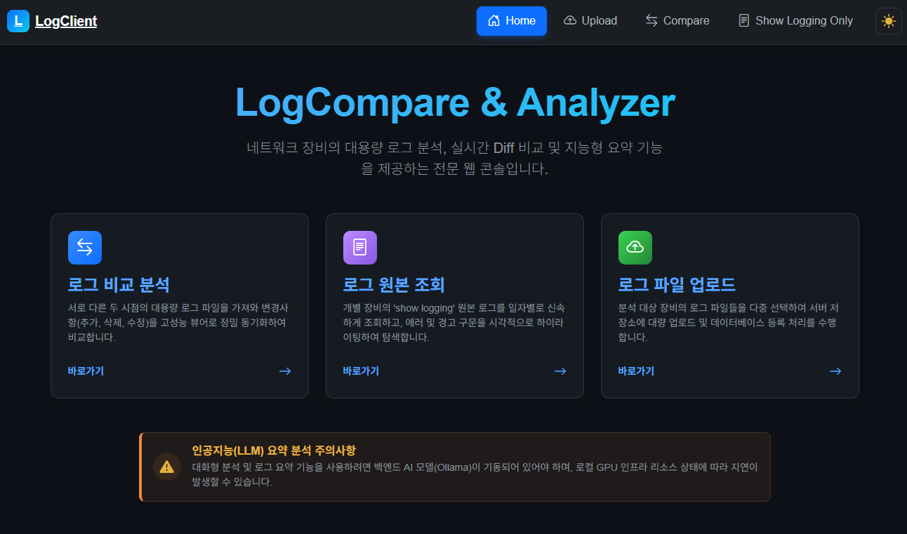
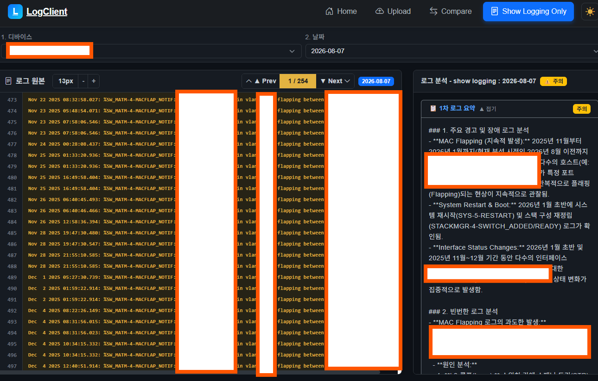
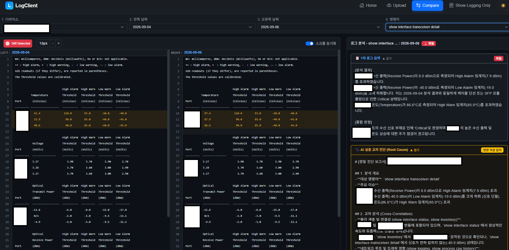

# LogCompare

대용량 네트워크 장비 로그를 파싱하여 구조화하고, 과거 점검 이력과의 Diff 비교 및 2단계 로컬 AI를 통한 이상 징후 진단을 제공하는 웹 플랫폼입니다.







---

## 🚀 주요 기능

### 1. 다채널 로그 수집 및 자동 구조화
- **웹 UI 일괄 업로드**: 브라우저에서 다중 로그 파일을 드래그 앤 드롭하여 실시간으로 파싱 및 적재합니다.
- **로컬 디렉터리 자동 수집**: 백그라운드 워커가 폴더로 유입되는 신규 로그 파일을 주기적으로 감지하여 데이터베이스에 자동 적재합니다.
- **파일명 메타데이터 정밀 추출**: 파일명의 다중 구분자 패턴에서 확장자와 날짜를 안전하게 분리 파싱하여 장비명, 점검 일자, 명령어별로 체계적으로 분류합니다.

### 2. 대용량 로그 뷰어 및 시각적 Diff 비교
- **가상 스크롤 렌더링**: 수만 줄 이상의 대용량 텍스트 로그도 지연 없이 매끄럽게 조회합니다.
- **시각적 Diff 비교**: 동일 장비의 점검 일자 간 변경점을 나란히 또는 인라인으로 색상별 비교합니다.
- **시스템 로그 하이라이팅**: 에러, 경고, 포트 다운 등 주요 시스템 메시지를 자동으로 강조 표시하여 빠른 탐색을 지원합니다.

### 3. 2단계 로컬 AI 로그 분석
폐쇄망 환경에서도 외부 데이터 유출 없이 온디바이스 LLM을 통해 정밀 분석을 수행합니다.
- **1차 명령어별 독립 요약**:
  - 명령어 원본 로그를 분석하여 핵심 지표를 요약하고 정상, 주의, 위험 3단계 심각도를 판정합니다.
- **2차 심층 교차 진단**:
  - 1차 요약에서 이상 징후 감지 시 동일 장비의 다른 모든 명령어 요약본을 교차 분석합니다.
  - 문제의 근본 원인, 명령어 간 인과관계, 시스템 영향도 및 엔지니어 조치 권고안을 종합 도출합니다.
- **데이터 기반 자율 분석**:
  - 특정 모델명에 의존하지 않고 수집된 명령어 데이터를 기반으로 중단 없는 분석 파이프라인을 유지합니다.

### 4. 프롬프트 정규화 엔진
- **순수 기본 명령어 단일화**:
  - 스택 번호, 파티션, 파이프 필터링 옵션 등 파일명 접미사를 제거하고 대표 프롬프트 템플릿으로 매핑을 단일화합니다.
- **계층형 명령어 매칭**:
  - 로그 파일명에 필터나 축약어가 포함되어 있더라도 본체 명령어를 자동 추출 및 정규화하여 프롬프트 매핑을 보장합니다.
- **명확한 기술 지시체 표준화**:
  - 불필요한 사족과 환각을 방지하기 위해 프롬프트 지시문을 간결하고 명확한 기술 표준 문체로 일원화했습니다.
- **프롬프트 가이드라인**:
  - 신규 명령어 추가 시 준수할 규칙을 [PROMPT_GUIDE.md](./01_LogCompare/.prompts/PROMPT_GUIDE.md)에 체계화했습니다.

### 5. 사용자 인터페이스
- **아코디언 카드**: 요약 및 교차 진단 카드를 헤더 클릭으로 독립적으로 접고 펼칠 수 있습니다.
- **고대비 다크 테마**: 장시간 분석 환경을 고려하여 선명한 가독성과 반응형 레이아웃을 제공합니다.
- **대화형 AI 어시스턴트**: 조회 중인 장비의 로그 콘텍스트를 기반으로 실시간 질의응답을 지원합니다.

---

## 📂 프로젝트 구조

```
01_LogCompare/
├── LogClient/                  # Blazor WebAssembly 프론트엔드
├── LogAPI/                     # ASP.NET Core Minimal API 백엔드
├── LogWorker/                  # 로컬 AI 분석 워커 서비스
├── LogLibrary/                 # 공통 데이터 모델, DbContext, 파싱 엔진
├── .prompts/                   # AI 분석 프롬프트 저장소
│   ├── Summary/                # 1차 요약 프롬프트
│   ├── Diagnosis/              # 2차 심층 진단 프롬프트
│   ├── system.txt              # 공통 시스템 프롬프트
│   └── PROMPT_GUIDE.md         # 프롬프트 관리 가이드
├── .raw_logs/                  # 원본 로그 수집 디렉터리
├── docker-compose.yml          # 컨테이너 오케스트레이션 정의
└── PRD.md                      # 상세 요구사항 정의서
```

---

> 상세한 시스템 아키텍처, 데이터베이스 스키마 및 비기능 요구사항은 [PRD.md](./01_LogCompare/PRD.md)를 참조하세요.
